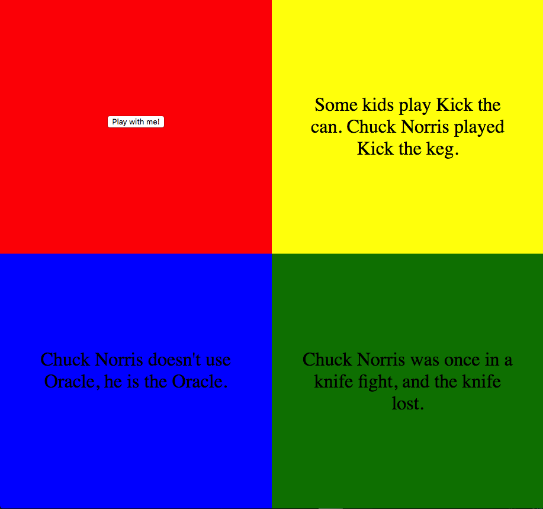

# Screen Code Test
For all new Frontend Developers being evaluated to join Jaggaer Direct development in Vienna Austria.

The test covers basic areas of HTML, CSS, JavaScript, DOM, Debugging and even some GIT. The completion of this assignment should not require more than 2 hours.

## Todo

Some people ask for a Kleenex when they sneeze, Chuck Norris asks for a body bag. 

The aim of this assignment is to create an HTML page which will display three random Chuck Norris jokes. Following points have to be met:
                                                                                                         
* Initially the browser window should be split up into 4 tiles of exactly the same size placed next to each other in form of a matrix (image below)
* Every tile should be of different color
  * Top left: Red
  * Top right: Yellow
  * Bottom left: Blue
  * Bottom right: green
* The tiles should fill up the whole browser window and resize when the window is being resized
* In case the screen width is below 700px, then boxes shall be under each other in the following order: Red, Yellow, Blue, Green
* Content is to be centered horizontally and vertically inside every tile
* The first (red) tile should have a button, when clicked on the following should happen:
  * Fetch three random jokes from the following API   
    ```https://api.icndb.com/jokes/random/```
  * Fill the yellow, blue and green tiles each with one joke accordingly
  * Make sure the text does not get out of bounds
  * Ensure that a joke is never repeated within one session
* On initial load, please pre-load three random jokes as if the button was clicked
* Perk 1: boxes can be re-ordered by drag and drop
* Perk 2: add an input box above the "Play with me!" button where a whole number can be entered, if set then that joke number (by ID) and the next three jokes are then fetched from the remote API. Check for max joke number (count-3), valid numbers, nice error handling, etc. Be creative!
 
This is how the end result should look like (with no Perks):



Please clone this repository and provide your solution in the [answer folder](./answer), once done please pack them into a ZIP/TAR file.

## Questions?

If you have any questions do not hesitate to ask and send an email with subject "Frontend Task Question" to [akulikov@jaggaer.com](akulikov@jaggaer.com) 

## How to Submit your Result 

1. Put your solution in an archive (e.g. ZIP, TAR) and name the archive file lastname_firstname_frontend_test.zip
2. Upload your solution to the private cloud storage of your choice (e.g. Google Drive, Dropbox)
3. Share this file with us through a link you create in your cloud storage
4. Send us an e-mail:
  * Subject: Frontend Test Result firstname lastname
  * To: the person who sent you the original mail and
  * Cc: akulikov@jaggaer.com, cherndler@jaggaer.com 
  * Body: 
    * the link where we can download your solution
    * any additional information you like to pass to us (e.g. why you solved things in a certain way, etc.)
